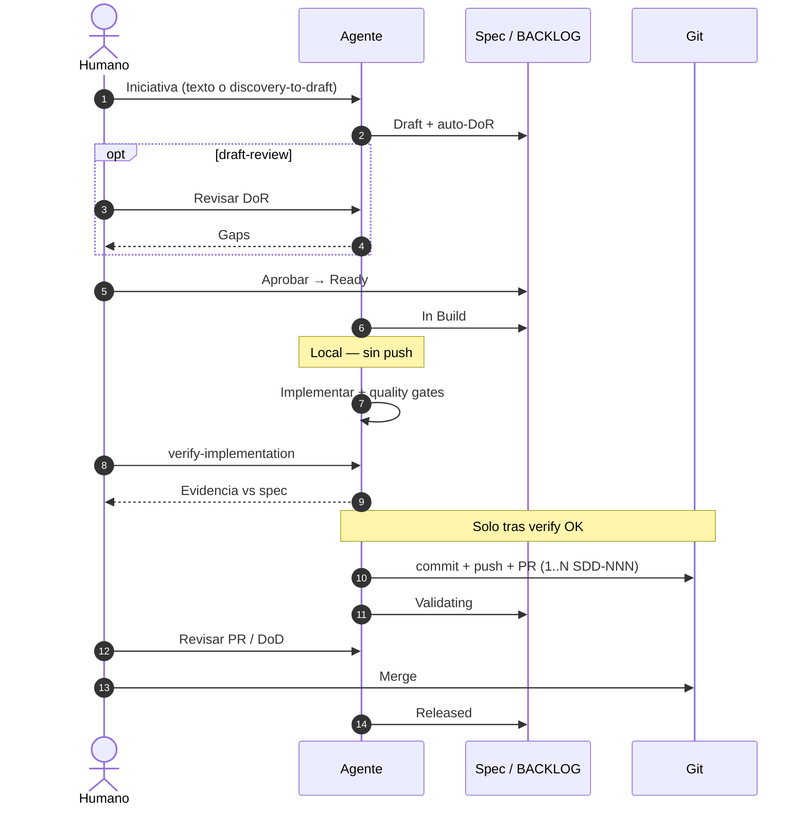

# SDD-003 — Refactor del ciclo SDD: momentos semánticos vs prompts

---

## Cabecera

| Campo                 | Valor                                                             |
| --------------------- | ----------------------------------------------------------------- |
| **ID**                | `SDD-003`                                                         |
| **Dominio**           | `core`                                                            |
| **Tipo**              | `refactor`                                                        |
| **Fecha**             | 2026-06-12                                                        |
| **Estado**            | `Validating`                                                      |
| **Versión objetivo**  | v1.2.0                                                            |
| **Owner**             | mantenedor                                                        |
| **Prioridad**         | `P1`                                                              |
| **ADRs relacionados** | —                                                                 |
| **Dependencias**      | — (independiente de SDD-002; puede mergearse en la misma campaña) |

---

## Problema y objetivo

**Problema:**

El ciclo SDD mezcla **estados del spec** (Discovery → Released) con **prompts del catálogo** como si fueran pasos obligatorios 1:1. Eso genera fricción en desarrollador solo:

- `draft-review` parece una fase obligatoria cuando solo verifica DoR.
- `approve-ready` e `implement-spec` duplican el mismo ritual (aprobar + codificar).
- No hay un paso explícito de **validación de lo implementado** antes de abrir el PR.
- Los diagramas actuales son flowcharts lineales (`flowchart LR`) que no muestran quién actúa (humano vs agente) ni cuándo hace falta un prompt copy-paste.
- El catálogo sugiere que cada spec termina en un PR, sin documentar agrupación de varios specs.

**Objetivo:**

Refactorizar la documentación del ciclo SDD para separar claramente **momentos semánticos** (estados y gates) de **prompts** (disparadores explícitos del humano), añadir la fase de verificación post-implementación, y reemplazar flowcharts simples por **diagramas de secuencia** (ZenUML o Mermaid `sequenceDiagram`) que mejoren el entendimiento del flujo humano–agente.

---

## Alcance

**Incluye:**

- Modelo conceptual **Momento semántico vs Prompt** documentado en `core/workflow.md` y `core/prompt-catalog.md`.
- Nuevo prompt `verify-implementation` entre In Build y Validating.
- Fusión documental de `approve-ready` + `implement-spec` en un único prompt `build-spec` (con modo retomar); deprecación suave de los dos anteriores (alias o redirección en catálogo).
- `draft-review` marcado explícitamente como **opcional** (ritual DoR, no estado).
- Guía de **N specs → 1 PR** en `workflow.md` y `checklist-pr.md`.
- Diagramas de secuencia (ZenUML preferido; Mermaid `sequenceDiagram` donde GitHub deba renderizar sin plugin) en:
  - `core/workflow.md`
  - `core/prompt-catalog.md`
  - `core/concepts.md` (reemplazar o complementar el resumen del ciclo)
  - `bootstrap/agent-prompts/sdd-agent-workflow.md` y `.cursor/rules/sdd-agent-workflow.mdc` (sincronizados vía `sync-cursor-rules.py`)
- Actualizar `sdd-workflow-reference.mdc` con checklist de verificación post-implementación.
- Fichas YAML de prompts afectados en `core/prompts/workflow/`.
- Entrada en `docs/releases/v1.2.0/` al cerrar (fuera de este spec; se documenta en DoD).

**Excluye explícitamente:**

- Cambios en la CLI (`sdd prompt list`) más allá de descubrir el nuevo prompt por filesystem existente.
- Nuevos estados en cabecera del spec (sigue siendo Draft / Ready / In Build / Validating / Released).
- Modificar `validate-sdd` para validar sintaxis ZenUML.
- Cambios en perfiles de stacks consumidores (Laravel, FastAPI, etc.).
- Automatización CI que bloquee PRs por diagramas.

---

## Impacto técnico

| Pregunta                                            | Respuesta                                                                                                                            |
| --------------------------------------------------- | ------------------------------------------------------------------------------------------------------------------------------------ |
| ¿Afecta `core/` (workflow, plantillas, guías)?      | **Sí** — `workflow.md`, `prompt-catalog.md`, `concepts.md`, `checklist-pr.md`, prompts en `core/prompts/workflow/`, `agent-setup.md` |
| ¿Afecta `profiles/<stack>/`?                        | No aplica — el ciclo core es agnóstico; perfiles no cambian                                                                          |
| ¿Afecta `bootstrap/`?                               | **Sí** — `agent-prompts/sdd-agent-workflow.md`, `sdd-workflow-reference.md`; regenerar reglas Cursor                                 |
| ¿Afecta `cli/`?                                     | No aplica — los prompts se leen del filesystem                                                                                       |
| ¿Afecta `.github/workflows/` o reglas Cursor?       | **Sí** — reglas Cursor generadas desde bootstrap                                                                                     |
| ¿Requiere actualizar `README.md` o `INSTALL.md`?    | **Sí** — README si menciona prompts obsoletos o flujo lineal                                                                         |
| ¿Afecta instancia SDD (BACKLOG, specs, sdd.config)? | Solo este spec y su cierre en release                                                                                                |
| ¿Afecta reglas en `business/domain-rules.md`?       | **Sí** — regla #4 ("El agente ejecuta; el humano aprueba") puede ampliarse para citar momentos semánticos vs prompts                 |
| ¿Introduce decisión arquitectónica transversal?     | No — es refinamiento documental del ciclo existente                                                                                  |

**Reglas de negocio aplicables** (`.github/docs/business/domain-rules.md`):

- #1 Core agnóstico al stack — mantener; los cambios son metodológicos.
- #4 El agente ejecuta; el humano aprueba — **refinar**, no eliminar: Ready y merge siguen siendo gates humanos.
- #6 Documentación SDD en `paths.sdd` — el spec vive aquí; los cambios de producto van en `core/`.

---

## Reglas de negocio

- Los **estados del spec** son la fuente de verdad del progreso; los **prompts** son atajos opcionales para disparar trabajo o aprobaciones.
- **Ready** permanece como momento semántico obligatorio antes de codificar (congelación de alcance).
- **Validating** no sustituye la verificación funcional: esta ocurre antes, en In Build, con evidencia documentada.
- **Nada sale al remoto sin verificar:** commit de entrega, `push` y PR solo después de `verify-implementation` en verde (ver sección siguiente).
- Un PR puede referenciar **varios** `SDD-NNN` si cada spec cumple DoD en ese entregable.

---

## Diseño: momentos semánticos vs prompts

### Definiciones

| Concepto              | Qué es                                                                  | Ejemplo                                     |
| --------------------- | ----------------------------------------------------------------------- | ------------------------------------------- |
| **Momento semántico** | Cambio de estado, gate o ritual con criterio de salida en `workflow.md` | Pasar spec a `Ready` tras aprobación humana |
| **Prompt**            | Plantilla copy-paste del catálogo para **disparar** trabajo del agente  | `discovery-to-draft`, `build-spec`          |
| **Regla always-on**   | Comportamiento del agente sin prompt explícito                          | `sdd-agent-workflow.mdc` en adopción madura |

### Cuándo hace falta un prompt

| Situación                                           | ¿Prompt?      | Motivo                                                                                                     |
| --------------------------------------------------- | ------------- | ---------------------------------------------------------------------------------------------------------- |
| Idea nueva con agente en adopción madura (Etapa 2+) | **No**        | Las reglas ejecutan el ciclo; describes la necesidad                                                       |
| Adopción, excepciones, upgrade kit, hotfix          | **Sí**        | Tarea puntual con comandos y alcance acotado                                                               |
| Aprobación humana (Ready, merge PR)                 | **Semántico** | Una frase basta: _"Apruebo SDD-003 para implementar"_ — no requiere ficha si el agente ya conoce el ritual |
| Verificación DoR en spec Draft                      | **Opcional**  | `draft-review` solo si quieres informe formal de gaps                                                      |
| Implementar spec aprobado                           | **Opcional**  | `build-spec` si retomas sesión; si sigues en el mismo hilo, la regla basta                                 |
| Verificar implementación vs spec                    | **Sí**        | `verify-implementation` — **obligatorio antes de push/PR**; evidencia local                                |
| Publicar en Git (commit entrega, push, PR)          | **No**        | Solo tras verify OK; `open-pr` es el ritual explícito si hace falta                                        |
| Revisar antes de merge                              | **Semántico** | _"Valida el PR de SDD-003"_ o `validate-pr`                                                                |

### Prompts del ciclo (propuesta)

| ID (nuevo/ajuste)       | Fase workflow  | Obligatoriedad  | Reemplaza / notas                           |
| ----------------------- | -------------- | --------------- | ------------------------------------------- |
| `discovery-to-draft`    | Discovery      | Opcional        | Sin cambio                                  |
| `draft-review`          | Draft          | **Opcional**    | Solo ritual DoR                             |
| `build-spec`            | Ready/In Build | Opcional        | Fusiona `approve-ready` + `implement-spec`  |
| `verify-implementation` | In Build       | **Obligatorio** | **Nuevo** — gate local **antes** de push/PR |
| `open-pr`               | Validating     | Opcional        | Solo después de verify; publica a remoto    |
| `validate-pr`           | Validating     | Opcional        | Ritual DoD; frase humana equivalente        |
| `close-release`         | Released       | Sí (cierre)     | Sin cambio                                  |

`approve-ready` e `implement-spec` quedan como **alias deprecados** en el catálogo (enlazan a `build-spec`) durante al menos una versión minor.

### N specs en un PR

Criterios para agrupar:

1. Misma campaña de release o entrega coherente.
2. Cada spec en estado `Validating` o listo para pasar a ello.
3. Descripción del PR lista todos los `SDD-NNN` y marca criterios de aceptación por spec.
4. Al cerrar release, cada spec se archiva individualmente.

### Orden: verificación antes de Git compartido

La implementación y la publicación en Git son **dos momentos distintos**. El error del flujo anterior es mezclarlos.

| Fase local (In Build)          | Git compartido (hacia Validating) |
| ------------------------------ | --------------------------------- |
| Rama local opcional            | Commit de entrega                 |
| Código según spec              | `push` al remoto                  |
| Quality gates en verde         | Apertura de PR                    |
| **`verify-implementation` OK** | Estado spec → `Validating`        |

**Permitido antes de verify:** trabajo en working tree, rama local, commits WIP locales (sin push).

**Prohibido antes de verify:** `push`, PR, solicitud de merge, cualquier exposición del cambio al remoto o a revisores.

`build-spec` termina en código + gates locales; **no** incluye push ni PR. Eso es responsabilidad de `verify-implementation` (gate) + `open-pr` (publicación).

---

## Diagramas de secuencia (reemplazo de flowcharts)

### Criterio de elección

| Formato                       | Cuándo usarlo                                                             |
| ----------------------------- | ------------------------------------------------------------------------- |
| **ZenUML**                    | Fuente en `core/` cuando el foco es interacción humano–agente–git         |
| **Mermaid `sequenceDiagram`** | Copia o alternativa en el mismo doc para render en GitHub sin extensiones |

No usar `flowchart LR` para el ciclo principal salvo mapas de **catálogo** (onboarding ↔ excepciones) donde no hay secuencia temporal.

### Secuencia objetivo del ciclo (ZenUML — referencia de diseño)

```zenuml
@startuml
title Ciclo SDD — desarrollador solo (deber ser)

actor Humano
participant Agente
participant "Spec / BACKLOG" as SDD
participant Git

Humano -> Agente: Describe iniciativa (o prompt discovery-to-draft)
Agente -> SDD: Discovery → Draft, auto-DoR
opt Revisión formal DoR
  Humano -> Agente: draft-review (opcional)
  Agente --> Humano: Gaps numerados
end
Humano -> SDD: Aprueba → Ready\n(momento semántico; frase o build-spec)
Agente -> SDD: Ready → In Build
note over Agente: Local — sin push
Agente -> Agente: Implementar + quality gates
Humano -> Agente: verify-implementation (obligatorio)
Agente --> Humano: Evidencia vs criterios + domain-rules
note over Agente, Git: Solo tras verify OK
Agente -> Git: commit entrega + push + PR (1..N specs)
SDD -> SDD: In Build → Validating
Humano -> Agente: Valida PR (momento semántico)
Humano -> Git: Merge
Agente -> SDD: Released + archive + release notes
@enduml
```

### Secuencia Mermaid (render GitHub)



---

## Criterios de aceptación

**Happy path:**

- [x] `core/workflow.md` documenta la distinción momento semántico vs prompt con tabla y criterios de cuándo copiar un prompt.
- [x] Existe `core/prompts/workflow/verify-implementation.md` y `core/prompts/workflow/build-spec.md`.
- [x] `approve-ready.md` e `implement-spec.md` muestran aviso de deprecación y enlace a `build-spec`.
- [x] `draft-review.md` indica explícitamente que es opcional.
- [x] `prompt-catalog.md` usa diagrama de secuencia (no flowchart lineal) para el ciclo principal.
- [x] `workflow.md` y `concepts.md` incluyen al menos un `sequenceDiagram` Mermaid del ciclo humano–agente.
- [x] Sección "Varios specs en un PR" presente en `workflow.md` y referenciada en `checklist-pr.md`.
- [x] `sdd-agent-workflow.mdc` y bootstrap equivalente actualizados: fase verify antes de Validating; `draft-review` opcional.
- [x] `sdd-workflow-reference.mdc` incluye checklist "Verificación post-implementación" (criterios de aceptación, domain-rules, arquitectura sana) y regla **no push/PR antes de verify**.
- [x] `build-spec` y `open-pr` documentan explícitamente: implementación local primero; publicación en Git solo tras verify OK.
- [x] `python bootstrap/sync-cursor-rules.py` ejecutado; reglas Cursor coherentes.
- [x] README no contradice el nuevo modelo (sin flujo 1 prompt = 1 fase obligatoria).

**Error path:**

- [x] Si se elimina un prompt sin alias, el catálogo y `sdd prompt show` no dejan IDs huérfanos sin redirección documentada.
- [x] Los diagramas ZenUML están acompañados de Mermaid equivalente o nota de visualización para quien no tenga plugin.
- [x] Ningún cambio en `core/` introduce referencias a stacks concretos (regla #1 domain-rules).

---

## Diseño técnico

**Archivos principales:**

| Archivo                                             | Cambio                                                              |
| --------------------------------------------------- | ------------------------------------------------------------------- |
| `core/workflow.md`                                  | Modelo momentos vs prompts; secuencia; N specs/PR; tabla de prompts |
| `core/prompt-catalog.md`                            | Reescritura sección "cuándo prompt"; secuencia; índice prompts      |
| `core/concepts.md`                                  | Actualizar resumen del ciclo con secuencia                          |
| `core/checklist-pr.md`                              | Multi-spec; evidencia de verify                                     |
| `core/prompts/workflow/build-spec.md`               | **Nuevo**                                                           |
| `core/prompts/workflow/verify-implementation.md`    | **Nuevo**                                                           |
| `core/prompts/workflow/approve-ready.md`            | Deprecación → `build-spec`                                          |
| `core/prompts/workflow/implement-spec.md`           | Deprecación → `build-spec`                                          |
| `core/prompts/workflow/draft-review.md`             | Marcar opcional                                                     |
| `bootstrap/agent-prompts/sdd-agent-workflow.md`     | Fases alineadas                                                     |
| `bootstrap/agent-prompts/sdd-workflow-reference.md` | Checklist verify                                                    |
| `.cursor/rules/sdd-agent-workflow.mdc`              | Generado                                                            |
| `.cursor/rules/sdd-workflow-reference.mdc`          | Generado                                                            |
| `README.md`                                         | Alinear mención del ciclo                                           |
| `.github/docs/business/domain-rules.md`             | Ampliar regla #4 (opcional, una línea)                              |

---

## Verificación técnica

```bash
python -m compileall -q cli/
python bootstrap/sync-cursor-rules.py
# Si tocó docs SDD de instancia:
bash bootstrap/validate-sdd.sh   # o validate-sdd.ps1 en Windows
```

Revisión manual: render de Mermaid en vista previa GitHub; enlaces internos del catálogo.

---

## Riesgos y rollback

| Riesgo                                         | Probabilidad | Impacto | Mitigación                                               |
| ---------------------------------------------- | ------------ | ------- | -------------------------------------------------------- |
| Confusión por prompts deprecados               | Media        | Medio   | Alias y tabla de migración en catálogo durante v1.2.x    |
| ZenUML no renderiza en GitHub                  | Alta         | Bajo    | Siempre incluir Mermaid `sequenceDiagram` equivalente    |
| Agentes siguen flujo viejo por caché de reglas | Media        | Medio   | Resync cursor rules; mencionar en release notes          |
| Sobrecarga de documentación                    | Baja         | Medio   | Una secuencia canónica en `workflow.md`; el resto enlaza |

**Rollback:** Revertir commit en `core/` y bootstrap; restaurar prompts anteriores desde git.

---

## Notas post-implementación

- Origen: análisis de fricción del ciclo en sesión de diseño (2026-06-12).
- Relacionado con dogfooding: este spec aplica el mismo ciclo que describe.
