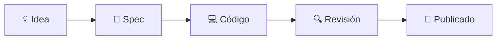

<div align="center">

# SDD Kit — Spec-Driven Development

Metodología para desarrollar **con un plan antes de codear**. Pensada para equipos pequeños y desarrollo asistido por agente de IA (Cursor, Claude Code, Codex, Copilot): el agente redacta specs y código; tú apruebas en puntos clave.

[](https://github.com/jcalistop/sdd-kit)
[](core/workflow.md)
[](profiles/)
[](core/agent-setup.md)

**Repositorio:** https://github.com/jcalistop/sdd-kit

</div>

---

## Navegación rápida

|     | Documento                                       | Para qué                                    |
| --- | ----------------------------------------------- | ------------------------------------------- |
| 🚀  | [Instalación](INSTALL.md)                       | Submodule, copia puntual o solo docs        |
| 📖  | [Conceptos en 5 min](core/concepts.md)          | Primera vez con SDD + glosario              |
| 🗺️  | [Adopción incremental](core/adoption-guide.md)  | Etapas 1–3 en proyectos nuevos o existentes |
| 🤖  | [Configuración del agente](core/agent-setup.md) | Cursor, Claude, Codex, Copilot              |
| 🧭  | [Ciclo SDD](core/workflow.md)                   | Estados, DoR/DoD, releases                  |
| 🛠️  | [CLI](cli/README.md)                            | `validate`, `backlog`, `spec new`           |
| 💬  | [Catálogo de prompts](core/prompt-catalog.md)   | Plantillas copy-paste por fase y adopción   |

---

## ¿Para quién es esto?

| Si eres…                                 | Este kit te ayuda a…                                                      |
| ---------------------------------------- | ------------------------------------------------------------------------- |
| 👤 **Desarrollador principiante en SDD** | Entender el flujo, instalarlo en tu proyecto y no perderte entre archivos |
| ⚙️ **Desarrollador con experiencia**     | Estandarizar specs, backlog, releases y calidad por stack                 |
| 🤝 **Solo dev + agente IA**              | Que el agente siga reglas claras (spec antes de código, checklist en PR)  |

> 💡 No necesitas conocer SDD de antemano. Empieza por **[`core/concepts.md`](core/concepts.md)** (5 minutos, glosario incluido).

---

## La idea en 30 segundos

1. Tienes una **idea o tarea** → la anotas en `BACKLOG.md`.
2. Antes de codear, escribes un **spec** (documento corto): qué quieres, qué no incluye, cómo sabrás que está listo.
3. Cuando el spec está **aprobado**, implementas (o el agente implementa).
4. Al terminar, archivas el spec y registras la **release**.



Más detalle: [`core/concepts.md`](core/concepts.md) · ciclo completo: [`core/workflow.md`](core/workflow.md).

---

## Requisitos previos

Antes de instalar, verifica lo siguiente (además del stack de tu perfil: PHP, Node, etc.).

| Requisito                                           | Obligatorio                    | Para qué                                                      |
| --------------------------------------------------- | ------------------------------ | ------------------------------------------------------------- |
| **Git**                                             | Sí                             | Submodule del kit en tu repo                                  |
| **Python 3.10+**                                    | Recomendado                    | CLI (`validate`, `backlog`, `spec new`) y `install-agents.py` |
| **Agente IA** (Cursor, Claude Code, Codex, Copilot) | Recomendado                    | Adopción guiada y flujo spec → código                         |
| **Pandoc + LaTeX**                                  | Solo perfil `reports-latex-md` | Compilar informes a PDF/DOCX                                  |
| **`gh` CLI**                                        | Opcional                       | Sync de BACKLOG con GitHub Issues                             |

Comprobar Python: `python --version` o `py -3 --version` (Windows).

---

## Empieza aquí (desarrollador principiante)

### Paso 1 — Elige tu perfil

El **perfil** adapta tests, deploy y checklist a tu tecnología (o a informes, si no es una app).

| Perfil                                                    | Cuándo usarlo                          |
| --------------------------------------------------------- | -------------------------------------- |
| [`laravel-filament`](profiles/laravel-filament/README.md) | Laravel + panel Filament               |
| [`laravel-voyager`](profiles/laravel-voyager/README.md)   | Laravel + Voyager + Livewire           |
| [`python-fastapi`](profiles/python-fastapi/README.md)     | API con FastAPI                        |
| [`python-django`](profiles/python-django/README.md)       | Django web, admin, DRF/Celery opcional |
| [`react-vite`](profiles/react-vite/README.md)             | Frontend React + Vite                  |
| [`reports-latex-md`](profiles/reports-latex-md/README.md) | Informes Markdown/LaTeX → PDF/DOCX     |
| [`sdd-kit`](profiles/sdd-kit/README.md)                   | Mantenedores del repositorio sdd-kit   |

### Paso 2 — Añade el kit (solo tú, un comando)

Desde la raíz de tu repo:

```powershell
git submodule add https://github.com/jcalistop/sdd-kit.git sdd-kit
git submodule update --init
```

En Linux/macOS es el mismo comando `git submodule`. **Detén aquí** si vas a usar modo agente (recomendado abajo).

### Paso 3 — Adopta SDD (elige tu escenario)

#### Proyecto nuevo — puedes ejecutar `init-sdd` tú mismo

```bash
python sdd-kit/cli/sdd.py init --profile laravel-filament --project "Mi App"
```

Atajos: `./sdd-kit/bootstrap/init-sdd.sh` (bash) · `.\sdd-kit\bootstrap\init-sdd.ps1` (solo PowerShell).

Por defecto detecta tu agente/IDE (`-Agent auto`) e instala las reglas SDD. Ver **[`core/agent-setup.md`](core/agent-setup.md)**.

#### Proyecto existente — modo agente (recomendado)

> **No ejecutes `init-sdd` a ciegas** en un repo con código y documentación ya en marcha. Un bootstrap manual puede pisar archivos o crear estructura sin contexto del proyecto.

**Tú:** añade el submodule (Paso 2) y abre el chat del agente.

**El agente:** sigue [`core/adoption-guide.md`](core/adoption-guide.md) Etapa 1, lee lo que ya existe y no sobrescribe documentación sin tu aprobación.

Usa el prompt **`adopt-existing`** del [catálogo de prompts](core/prompt-catalog.md):

```bash
python sdd-kit/cli/sdd.py prompt show adopt-existing
```

Copia la salida en el chat del agente (adapta `<PERFIL>`). Guía detallada: **[INSTALL.md](INSTALL.md)** — sección «Modo agente».

### Paso 4 — Completa lo mínimo (día 1)

Si no usaste el prompt anterior, completa a mano o pide al agente:

| Archivo                            | Qué poner                                                      |
| ---------------------------------- | -------------------------------------------------------------- |
| `.github/docs/sdd/sdd.config.yaml` | Nombre del proyecto, ramas, dominios (ej. `auth`, `api`, `ux`) |
| `.github/docs/business/README.md`  | Qué hace el sistema y quién lo usa                             |
| `.github/docs/sdd/BACKLOG.md`      | 3–5 tareas reales en **Discovery** (lo que viene ahora)        |

Checklist: **[`core/adoption-guide.md`](core/adoption-guide.md)** — Etapa 1.

### Paso 5 — Valida que todo esté bien

```bash
python sdd-kit/cli/sdd.py validate
```

Si pasa sin errores críticos, la estructura está lista.

### Paso 6 — Tu primer spec con el agente

Con adaptadores instalados, el agente ya tiene las reglas SDD. Para forzar el flujo explícitamente:

```bash
python sdd-kit/cli/sdd.py prompt show discovery-to-draft
```

Ver [catálogo de prompts](core/prompt-catalog.md) (`draft-review`, `approve-ready`, etc.). Revisa el spec; si está bien, aprueba → pasa a **Ready** → implementación.

Ejemplos de calidad por perfil: `profiles/<perfil>/examples/SDD-001-*.md`.

---

## Cómo trabajar con el agente

| Momento           | Tú (humano)                     | Agente                          |
| ----------------- | ------------------------------- | ------------------------------- |
| 💡 Nueva idea     | Describes el problema           | Anota en BACKLOG, propone spec  |
| 📝 Spec en Draft  | **Apruebas o corriges** el spec | Redacta spec, verifica DoR      |
| 🔨 Implementación | Autorizas empezar               | Codea según spec y perfil stack |
| ✅ PR             | **Revisas y mergeas**           | Checklist, tests, evidencia     |

Adaptadores instalados según tu herramienta (ver `sdd.config.yaml` → `agent.targets`). En Cursor: `sdd-core`, `sdd-agent-workflow`, `sdd-stack-<perfil>`.

> 🌱 **Desarrollo sano:** el agente también aplica [`core/healthy-development.md`](core/healthy-development.md) (evitar sobre-ingeniería y antipatrones).

---

## Archivos que usarás seguido

| Archivo                                                    | Para qué                                         |
| ---------------------------------------------------------- | ------------------------------------------------ |
| `BACKLOG.md`                                               | Lista única de tareas y su estado                |
| `specs/<dominio>/SDD-NNN-*.md`                             | Specs activos (una tarea = un spec)              |
| `business/domain-rules.md`                                 | Reglas de negocio que el agente no debe inventar |
| `templates/spec-template.md`                               | Plantilla completa (features técnicas)           |
| `templates/spec-simple-template.md`                        | Plantilla reducida (inicio o tareas simples)     |
| `checklist-pr.md` + `profiles/<perfil>/checklist-stack.md` | Qué revisar antes del merge                      |

---

## CLI (Python 3.10+)

```bash
python sdd-kit/cli/sdd.py validate
python sdd-kit/cli/sdd.py backlog
python sdd-kit/cli/sdd.py spec new --domain ux --type feature --title "Mi feature"
```

Detalle: **[cli/README.md](cli/README.md)**.

---

## Cómo está organizado el kit

Tres capas — no hace falta memorizarlas el día 1:

| Capa             | Dónde                                  | Qué es                                          |
| ---------------- | -------------------------------------- | ----------------------------------------------- |
| 🧩 **Core**      | `core/`                                | Ciclo SDD, plantillas, guías (igual para todos) |
| 📦 **Perfil**    | `profiles/<stack>/`                    | Tests, deploy y checklist de tu stack           |
| 📁 **Instancia** | `.github/docs/sdd/` en **tu** proyecto | Tu BACKLOG, specs y releases                    |

```
tu-proyecto/
├── sdd-kit/                    # submodule (el kit)
└── .github/docs/
    ├── sdd/                    # tu instancia SDD
    │   ├── BACKLOG.md
    │   ├── specs/
    │   └── sdd.config.yaml
    └── business/               # contexto de negocio
```

---

## Siguiente lectura (cuando avances)

| Documento                                                    | Cuándo leerlo                               |
| ------------------------------------------------------------ | ------------------------------------------- |
| [`core/concepts.md`](core/concepts.md)                       | Primera vez con SDD                         |
| [`core/adoption-guide.md`](core/adoption-guide.md)           | Proyecto nuevo o existente, etapas 1–3      |
| [`core/workflow.md`](core/workflow.md)                       | Estados, tipos de spec, DoR/DoD             |
| [`core/healthy-development.md`](core/healthy-development.md) | Buenas prácticas y antipatrones             |
| [`core/agent-setup.md`](core/agent-setup.md)                 | Cursor, Claude, Codex, Copilot              |
| [`INSTALL.md`](INSTALL.md)                                   | Otras formas de instalar (copia, solo docs) |

---

## Mantenedores del kit

| Recurso                                                      | Uso                                                                |
| ------------------------------------------------------------ | ------------------------------------------------------------------ |
| [.github/docs/sdd/BACKLOG.md](.github/docs/sdd/BACKLOG.md)   | Tablero operativo de iniciativas (dogfooding SDD)                  |
| [.github/docs/sdd/ADOPTION.md](.github/docs/sdd/ADOPTION.md) | Plan de adopción SDD en este repositorio                           |
| [docs/maintainers/](docs/maintainers/)                       | Análisis y roadmap histórico (no se copia a proyectos)             |
| [docs/releases/](docs/releases/)                             | Historial de versiones del kit ([v1.0.0](docs/releases/v1.0.0.md)) |

Crear perfiles nuevos: **[`core/templates/profile-template.md`](core/templates/profile-template.md)**.

## Comunidad y legal

| Documento                                | Descripción                             |
| ---------------------------------------- | --------------------------------------- |
| [CONTRIBUTING.md](CONTRIBUTING.md)       | Cómo contribuir (perfiles, core, CLI)   |
| [CODE_OF_CONDUCT.md](CODE_OF_CONDUCT.md) | Código de conducta                      |
| [SECURITY.md](SECURITY.md)               | Reporte responsable de vulnerabilidades |
| [LICENSE](LICENSE)                       | MIT                                     |

[](https://github.com/jcalistop/sdd-kit/actions/workflows/ci.yml)
