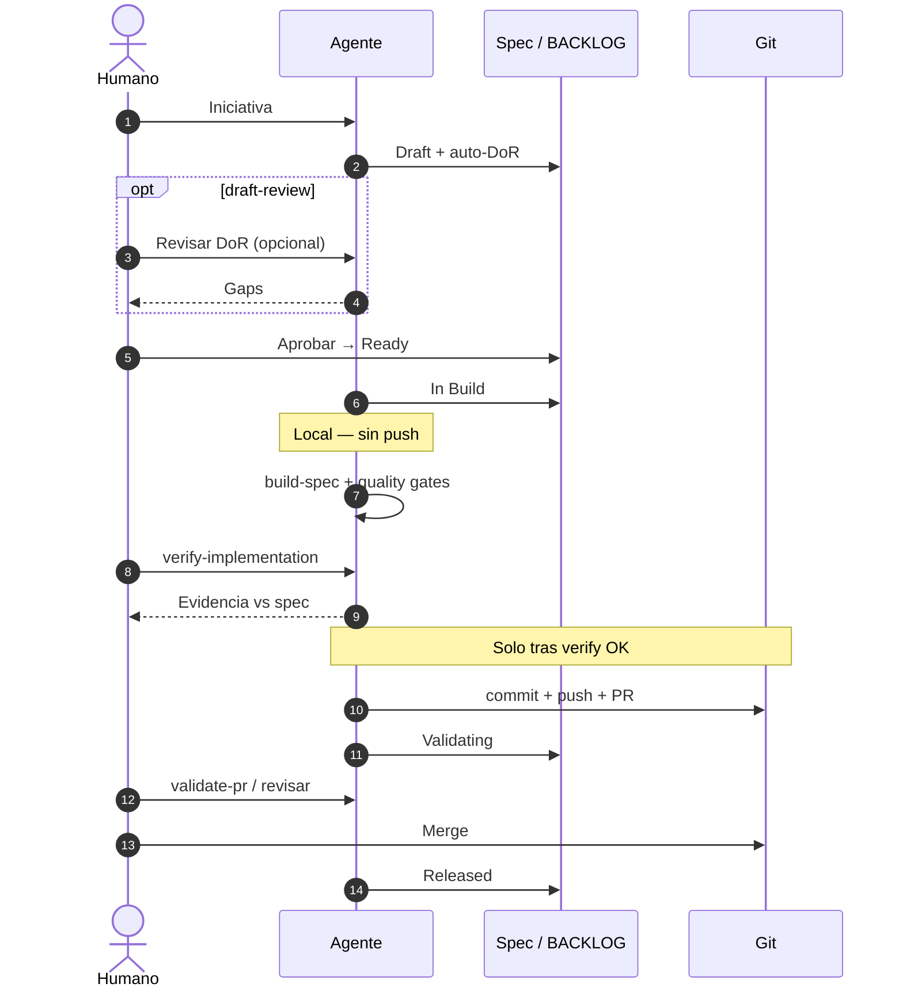
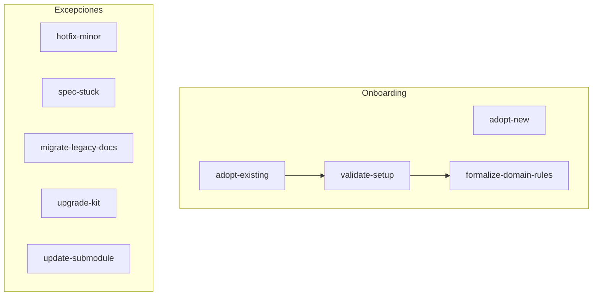

# Catálogo de prompts SDD

> Plantillas copy-paste para guiar al agente en adopción, ciclo de specs, PRs y releases.
> Los **estados del spec** son la fuente de verdad; los prompts son **disparadores opcionales** salvo tareas puntuales (adopción, excepciones).

**CLI:** `python sdd-kit/cli/sdd.py prompt list` · `prompt show <id>` · `prompt show <id> --full`

**Relacionado:** [`workflow.md`](workflow.md) · [`adoption-guide.md`](adoption-guide.md) · [`agent-setup.md`](agent-setup.md)

---

## Momentos semánticos vs prompts

| Concepto              | Qué es                                                  |
| --------------------- | ------------------------------------------------------- |
| **Momento semántico** | Estado, gate o frase humana definida en `workflow.md`   |
| **Prompt**            | Plantilla del catálogo para disparar trabajo del agente |
| **Regla always-on**   | Comportamiento del agente sin prompt (reglas del IDE)   |

| Situación                                  | ¿Prompt?                                  |
| ------------------------------------------ | ----------------------------------------- |
| Idea nueva con agente en adopción madura   | **No**                                    |
| Adopción, excepciones, upgrade kit, hotfix | **Sí**                                    |
| Aprobar spec → Ready                       | **Semántico** — frase basta               |
| Revisar DoR (`draft-review`)               | **Opcional**                              |
| Implementar (`build-spec`)                 | **Opcional** si retomas sesión            |
| Verificar vs spec antes de Git             | **Obligatorio** — `verify-implementation` |
| Publicar (commit, push, PR)                | Tras verify — `open-pr` si hace falta     |
| Revisar antes de merge                     | **Semántico** — frase o `validate-pr`     |

---

## Secuencia del ciclo (humano ↔ agente)

> Mermaid renderiza en GitHub. ZenUML (misma secuencia) en comentarios de mantenedores si se prefiere editor con plugin.

### Mapa de catálogo (onboarding y excepciones)

El ciclo principal no es un flowchart lineal: ver secuencia arriba y [`workflow.md`](workflow.md).

---

## Por momento

| Momento               | ID                       | Título                                  |
| --------------------- | ------------------------ | --------------------------------------- |
| Proyecto nuevo        | `adopt-new`              | Adoptar SDD en proyecto nuevo           |
| Proyecto existente    | `adopt-existing`         | Adoptar SDD en proyecto existente       |
| Post bootstrap        | `validate-setup`         | Validar instalación SDD                 |
| Antes del primer spec | `formalize-domain-rules` | Formalizar contexto de negocio          |
| Nueva iniciativa      | `discovery-to-draft`     | Discovery → spec Draft                  |
| Revisar borrador      | `draft-review`           | Revisar spec Draft (DoR) — **opcional** |
| Aprobar + implementar | `build-spec`             | Aprobar → In Build + código local       |
| Verificar vs spec     | `verify-implementation`  | Gate antes de push/PR — **obligatorio** |
| Abrir PR              | `open-pr`                | Publicar tras verify OK                 |
| Revisar PR            | `validate-pr`            | Validar PR antes de merge               |
| Cerrar versión        | `close-release`          | Cerrar release y archivar specs         |
| Urgencia / trivial    | `hotfix-minor`           | Hotfix o cambio sin spec                |
| Spec atascado         | `spec-stuck`             | Spec estancado o rechazado              |
| Etapa 3               | `migrate-legacy-docs`    | Migrar docs legacy a business/          |
| Mantenimiento kit     | `upgrade-kit`            | Actualizar kit en instancia (completo)  |
| Mantenimiento kit     | `update-submodule`       | Atajo legacy → preferir `upgrade-kit`   |

### Alias deprecados (v1.2.x)

| Deprecado        | Usar         |
| ---------------- | ------------ |
| `approve-ready`  | `build-spec` |
| `implement-spec` | `build-spec` |

Fichas: [`prompts/`](prompts/) — o `sdd prompt show <id> --full`

---

## Por fase SDD

| Fase       | Prompts                                           |
| ---------- | ------------------------------------------------- |
| Discovery  | `discovery-to-draft`                              |
| Draft      | `discovery-to-draft`, `draft-review` _(opcional)_ |
| Ready      | `build-spec`                                      |
| In Build   | `build-spec`, `verify-implementation`, `open-pr`  |
| Validating | `validate-pr`                                     |
| Released   | `close-release`                                   |

---

## Por etapa de adopción

| Etapa                      | Prompts                                                                   |
| -------------------------- | ------------------------------------------------------------------------- |
| **1** — Mínima viable      | `adopt-new`, `adopt-existing`, `validate-setup`, `formalize-domain-rules` |
| **2** — Features con SDD   | Todos los de `workflow/` + `hotfix-minor`, `spec-stuck`, `upgrade-kit`    |
| **3** — Cobertura completa | `migrate-legacy-docs` + ciclo completo en refactors                       |

---

## Placeholders

| Placeholder                | Reemplazar por                        |
| -------------------------- | ------------------------------------- |
| `<PERFIL>`                 | Perfil stack (ej. `laravel-filament`) |
| `<NOMBRE_PROYECTO>`        | Nombre en sdd.config.yaml             |
| `<DOMINIO>`                | Dominio de iniciativa en config       |
| `<SDD-NNN>`                | ID del spec (ej. `SDD-003`)           |
| `<VERSION>`                | Versión release (ej. `v1.2.0`)        |
| `<IDEA>` / `<DESCRIPCION>` | Texto libre de la iniciativa          |

---

## Índice de fichas

### adoption/

- [`adopt-new.md`](prompts/adoption/adopt-new.md)
- [`adopt-existing.md`](prompts/adoption/adopt-existing.md)
- [`validate-setup.md`](prompts/adoption/validate-setup.md)
- [`formalize-domain-rules.md`](prompts/adoption/formalize-domain-rules.md)

### workflow/

- [`discovery-to-draft.md`](prompts/workflow/discovery-to-draft.md)
- [`draft-review.md`](prompts/workflow/draft-review.md)
- [`build-spec.md`](prompts/workflow/build-spec.md)
- [`verify-implementation.md`](prompts/workflow/verify-implementation.md)
- [`open-pr.md`](prompts/workflow/open-pr.md)
- [`validate-pr.md`](prompts/workflow/validate-pr.md)
- [`close-release.md`](prompts/workflow/close-release.md)
- _Deprecados:_ [`approve-ready.md`](prompts/workflow/approve-ready.md), [`implement-spec.md`](prompts/workflow/implement-spec.md)

### exceptions/

- [`hotfix-minor.md`](prompts/exceptions/hotfix-minor.md)
- [`spec-stuck.md`](prompts/exceptions/spec-stuck.md)
- [`migrate-legacy-docs.md`](prompts/exceptions/migrate-legacy-docs.md)
- [`upgrade-kit.md`](prompts/exceptions/upgrade-kit.md)
- [`update-submodule.md`](prompts/exceptions/update-submodule.md)
