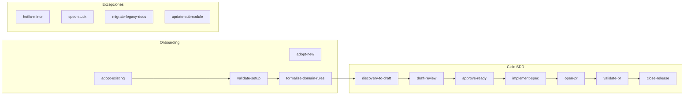

# Catálogo de prompts SDD

> Plantillas copy-paste para guiar al agente en adopción, ciclo de specs, PRs y releases.
> Las **reglas del agente** (`sdd-core`, `sdd-agent-workflow`) ya cubren mucho del flujo; este catálogo son **disparadores explícitos** para momentos donde tú inicias o apruebas.

**CLI:** `python sdd-kit/cli/sdd.py prompt list` · `prompt show <id>` · `prompt show <id> --full`

**Relacionado:** [`workflow.md`](workflow.md) · [`adoption-guide.md`](adoption-guide.md) · [`agent-setup.md`](agent-setup.md)

---

## Cuándo copiar un prompt vs dejar que las reglas actúen solas

| Situación                                                                | ¿Necesitas prompt?                            |
| ------------------------------------------------------------------------ | --------------------------------------------- |
| Adaptadores instalados (`sdd-agent-workflow`) y describes una idea nueva | **No** — el agente sigue el ciclo solo        |
| Adopción en proyecto existente, formalizar negocio, excepciones          | **Sí** — usa prompts de este catálogo         |
| Aprobar spec (Ready), revisar PR, cerrar release                         | **Sí** — requieren tu OK explícito            |
| Validar instalación o actualizar submodule                               | **Sí** — tarea puntual con comandos concretos |

---

## Mapa: momento → prompt

---

## Por momento

| Momento                | ID                       | Título                            |
| ---------------------- | ------------------------ | --------------------------------- |
| Proyecto nuevo         | `adopt-new`              | Adoptar SDD en proyecto nuevo     |
| Proyecto existente     | `adopt-existing`         | Adoptar SDD en proyecto existente |
| Post bootstrap         | `validate-setup`         | Validar instalación SDD           |
| Antes del primer spec  | `formalize-domain-rules` | Formalizar contexto de negocio    |
| Nueva iniciativa       | `discovery-to-draft`     | Discovery → spec Draft            |
| Revisar borrador       | `draft-review`           | Revisar spec Draft (DoR)          |
| Aprobar implementación | `approve-ready`          | Aprobar spec → Ready → In Build   |
| Codificar              | `implement-spec`         | Implementar spec aprobado         |
| Abrir PR               | `open-pr`                | Abrir PR con checklist SDD        |
| Revisar PR             | `validate-pr`            | Validar PR antes de merge         |
| Cerrar versión         | `close-release`          | Cerrar release y archivar specs   |
| Urgencia / trivial     | `hotfix-minor`           | Hotfix o cambio sin spec          |
| Spec atascado          | `spec-stuck`             | Spec estancado o rechazado        |
| Etapa 3                | `migrate-legacy-docs`    | Migrar docs legacy a business/    |
| Mantenimiento kit      | `update-submodule`       | Actualizar submodule sdd-kit      |

Fichas: [`prompts/`](prompts/) — o `sdd prompt show <id> --full`

---

## Por fase SDD

| Fase       | Prompts                                      |
| ---------- | -------------------------------------------- |
| Discovery  | `discovery-to-draft`                         |
| Draft      | `discovery-to-draft`, `draft-review`         |
| Ready      | `approve-ready`                              |
| In Build   | `approve-ready`, `implement-spec`, `open-pr` |
| Validating | `validate-pr`                                |
| Released   | `close-release`                              |

---

## Por etapa de adopción

| Etapa                      | Prompts                                                                   |
| -------------------------- | ------------------------------------------------------------------------- |
| **1** — Mínima viable      | `adopt-new`, `adopt-existing`, `validate-setup`, `formalize-domain-rules` |
| **2** — Features con SDD   | Todos los de `workflow/` + `hotfix-minor`, `spec-stuck`                   |
| **3** — Cobertura completa | `migrate-legacy-docs` + ciclo completo en refactors                       |

---

## Placeholders

| Placeholder                | Reemplazar por                        |
| -------------------------- | ------------------------------------- |
| `<PERFIL>`                 | Perfil stack (ej. `laravel-filament`) |
| `<NOMBRE_PROYECTO>`        | Nombre en sdd.config.yaml             |
| `<DOMINIO>`                | Dominio de iniciativa en config       |
| `<SDD-NNN>`                | ID del spec (ej. `SDD-003`)           |
| `<VERSION>`                | Versión release (ej. `v1.2.0`)        |
| `<IDEA>` / `<DESCRIPCION>` | Texto libre de la iniciativa          |

---

## Índice de fichas

### adoption/

- [`adopt-new.md`](prompts/adoption/adopt-new.md)
- [`adopt-existing.md`](prompts/adoption/adopt-existing.md)
- [`validate-setup.md`](prompts/adoption/validate-setup.md)
- [`formalize-domain-rules.md`](prompts/adoption/formalize-domain-rules.md)

### workflow/

- [`discovery-to-draft.md`](prompts/workflow/discovery-to-draft.md)
- [`draft-review.md`](prompts/workflow/draft-review.md)
- [`approve-ready.md`](prompts/workflow/approve-ready.md)
- [`implement-spec.md`](prompts/workflow/implement-spec.md)
- [`open-pr.md`](prompts/workflow/open-pr.md)
- [`validate-pr.md`](prompts/workflow/validate-pr.md)
- [`close-release.md`](prompts/workflow/close-release.md)

### exceptions/

- [`hotfix-minor.md`](prompts/exceptions/hotfix-minor.md)
- [`spec-stuck.md`](prompts/exceptions/spec-stuck.md)
- [`migrate-legacy-docs.md`](prompts/exceptions/migrate-legacy-docs.md)
- [`update-submodule.md`](prompts/exceptions/update-submodule.md)
