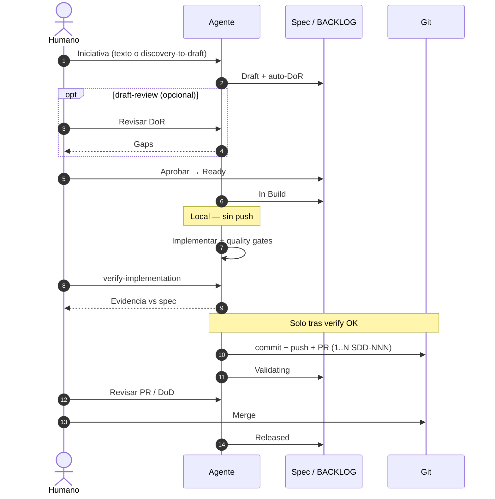

# Flujo Operativo SDD

Metodología spec-driven para un equipo pequeño en producción.
**Principio**: spec antes de código, evidencia antes de despliegue, archivo después de release.

**Release (operación):** [`releases/RUNBOOK.md`](releases/RUNBOOK.md) — cierre en repo, tag SemVer, despliegue según perfil de stack.

**Configuración del proyecto:** `sdd.config.yaml` (ramas, dominios, perfil).

---

## Estructura documental

Todo vive bajo la ruta `paths.sdd` del config (por defecto `.github/docs/sdd/`):

```
.github/docs/sdd/
├── sdd.config.yaml                 # instancia del proyecto
├── PROJECT.md                      # resumen de adopción SDD
├── README.md                       # índice
├── operations.md                   # rituales (puede enlazar al core o copia local)
├── workflow.md                     # este archivo (copia o enlace al kit)
├── BACKLOG.md                      # tablero único de iniciativas
├── checklist-pr.md                 # DoD trazabilidad (+ perfil stack)
├── healthy-development.md          # arquitectura, patrones, codigo limpio
├── templates/
├── specs/<dominio>/SDD-NNN-*.md
├── archive/<YYYY>/<dominio>/SDD-NNN-*.md
├── adr/ADR-*.md
├── releases/RUNBOOK.md
├── releases/README.md
└── releases/vX.Y.Z/
```

**Dominios** se definen en `sdd.config.yaml` → `domains`. Son etiquetas de **iniciativas**, no módulos de negocio (esos viven en `paths.business`).

---

## Ciclo por iniciativa

```
Discovery → Draft → Ready → In Build → Validating → Released
```

| Etapa          | Artefacto                                                | Criterio de salida                                                      |
| -------------- | -------------------------------------------------------- | ----------------------------------------------------------------------- |
| **Discovery**  | notas en BACKLOG                                         | Problema entendido, dominio y tipo declarados                           |
| **Draft**      | `specs/<dominio>/SDD-NNN-slug.md`                        | Definition of Ready (DoR) cumplida                                      |
| **Ready**      | spec con `Estado: Ready`                                 | Aprobación humana; alcance congelado; dependencias resueltas            |
| **In Build**   | código local + evidencia de verificación                 | Quality gates en verde; `verify-implementation` OK; **sin push/PR aún** |
| **Validating** | PR + [`checklist-pr.md`](checklist-pr.md) + perfil stack | DoD cumplida; revisión humana antes de merge                            |
| **Released**   | `archive/<YYYY>/<dominio>/` + entrada en release         | Mergeado, desplegado, archivado                                         |

### Momentos semánticos vs prompts

Los **estados** del spec son la fuente de verdad del progreso. Los **prompts** del [catálogo](prompt-catalog.md) son disparadores copy-paste opcionales; no son fases obligatorias 1:1.

| Concepto              | Qué es                                                               |
| --------------------- | -------------------------------------------------------------------- |
| **Momento semántico** | Cambio de estado, gate o frase humana con criterio en este documento |
| **Prompt**            | Plantilla del catálogo para disparar trabajo del agente              |
| **Regla always-on**   | Comportamiento del agente sin prompt (p. ej. reglas del IDE)         |

| Situación                        | ¿Prompt?    | Notas                                             |
| -------------------------------- | ----------- | ------------------------------------------------- |
| Idea nueva (adopción madura)     | No          | El agente sigue el ciclo; describes la necesidad  |
| Adopción, excepciones, upgrade   | Sí          | Tareas puntuales del catálogo                     |
| Aprobar spec → Ready             | Semántico   | Frase basta: _"Apruebo SDD-NNN para implementar"_ |
| Revisar DoR en Draft             | Opcional    | `draft-review`                                    |
| Implementar spec aprobado        | Opcional    | `build-spec` si retomas sesión                    |
| Verificar vs spec (antes de Git) | Obligatorio | `verify-implementation` — gate local              |
| Publicar (commit, push, PR)      | Tras verify | `open-pr` si hace falta ritual explícito          |
| Revisar antes de merge           | Semántico   | Frase o `validate-pr`                             |

### Secuencia del ciclo (humano ↔ agente)

> ZenUML equivalente en [`prompt-catalog.md`](prompt-catalog.md). Mermaid renderiza en GitHub sin extensiones.



### Verificación local antes de Git compartido

| Fase local (In Build)          | Git compartido (→ Validating) |
| ------------------------------ | ----------------------------- |
| Rama local opcional            | Commit de entrega             |
| Código según spec              | `push` al remoto              |
| Quality gates en verde         | Apertura de PR                |
| **`verify-implementation` OK** | Estado spec → `Validating`    |

**Permitido antes de verify:** working tree, rama local, commits WIP locales sin push.

**Prohibido antes de verify:** `push`, PR, solicitud de merge.

### Varios specs en un PR

Un PR puede referenciar **varios** `SDD-NNN` cuando:

1. Entrega coherente o misma campaña de release.
2. Cada spec cumple DoD en ese entregable.
3. La descripción del PR lista todos los IDs y criterios por spec.
4. Al cerrar release, cada spec se archiva individualmente.

Detalle en [`checklist-pr.md`](checklist-pr.md).

**Prompts por fase** (catálogo: [`prompt-catalog.md`](prompt-catalog.md)):

| Fase       | Prompt ID                                        |
| ---------- | ------------------------------------------------ |
| Discovery  | `discovery-to-draft`                             |
| Draft      | `draft-review` _(opcional)_                      |
| Ready      | `build-spec`                                     |
| In Build   | `build-spec`, `verify-implementation`, `open-pr` |
| Validating | `validate-pr`                                    |
| Released   | `close-release`                                  |

Alias deprecados (v1.2.x): `approve-ready`, `implement-spec` → usar `build-spec`.

Reglas de transición:

1. Cada cambio de estado en **cabecera del spec** y en **BACKLOG.md**.
2. En `specs/`, estados permitidos: `Draft`, `Ready`, `In Build`, `Validating`. **`Released` solo** tras `git mv` a `archive/`.
3. Al cerrar: `git mv` del spec y actualizar enlaces en BACKLOG.
4. Cambios triviales **no requieren spec** — registrar en release con ID `—`.
5. **`SDD-NNN` es global** en el repositorio (contador en BACKLOG).
6. **No `push` ni PR** hasta `verify-implementation` en verde.

### Descartado / en pausa

Solo en BACKLOG (no en cabecera del spec). Documentar razón y fecha.

### Hotfix

Rama `hotfix/…` → PR a rama de producción (ver [`branching.md`](branching.md)). Preferir spec `bugfix`; en urgencia extrema, ID `—` en release. Prompt: `hotfix-minor` en [`prompt-catalog.md`](prompt-catalog.md).

---

## Tipos de spec

| Tipo            | Cuándo                                                            | Profundidad                                  |
| --------------- | ----------------------------------------------------------------- | -------------------------------------------- |
| `feature`       | Funcionalidad nueva visible                                       | Completa                                     |
| `bugfix`        | Comportamiento incorrecto                                         | Simplificada                                 |
| `performance`   | Optimización sin cambio funcional                                 | Simplificada                                 |
| `refactor`      | Reestructuración interna                                          | Completa + equivalencia funcional            |
| `db-change`     | Cambio de esquema o datos                                         | Completa + sección "Cambio de BD"            |
| `documentation` | Doc, manual, release                                              | Simplificada                                 |
| `transcription` | Convertir fuentes a Markdown legible por agente (PDF, DOCX, etc.) | Simplificada — ver perfil `reports-latex-md` |

Combinaciones permitidas: `feature + db-change`, `bugfix + db-change`, `feature + transcription`, etc.

### Fase opcional: Transcription

Antes de **Draft**, cuando el perfil o el spec lo requiera (p. ej. `reports-latex-md`):

| Etapa             | Artefacto                                        | Criterio de salida                                                  |
| ----------------- | ------------------------------------------------ | ------------------------------------------------------------------- |
| **Transcription** | `.md` en `data/transcripts/` (ruta del proyecto) | Fuentes no legibles convertidas; método y limitaciones documentados |

No es un estado en cabecera del spec: se registra en BACKLOG o como spec tipo `transcription` hasta completar. Detalle: [`profiles/reports-latex-md/workflow-extensions.md`](../profiles/reports-latex-md/workflow-extensions.md).

---

## ADR — cuándo crear uno

Crear ADR cuando la decisión es **arquitectónica y transversal**:

1. Cambia una **convención global** del proyecto.
2. Afecta a **más de un módulo** o capa.
3. Introduce **dependencia o integración externa** nueva.
4. **Reemplaza** un ADR previo.

No crear ADR para cambios de esquema locales de un módulo (van en el spec).

Plantilla: [`templates/adr-template.md`](templates/adr-template.md).

---

## Definition of Ready (DoR)

- [ ] Tipo y dominio declarados
- [ ] Objetivo, alcance y exclusiones definidos
- [ ] Tabla **Impacto técnico** del spec completada (plantilla del perfil stack)
- [ ] Autorización evaluada si el cambio es visible para usuarios
- [ ] Si `db-change`: sección "Cambio de BD" completa
- [ ] Si decisión transversal: ADR creado y referenciado
- [ ] Criterios de aceptación (happy + error path)
- [ ] Riesgos y rollback documentados
- [ ] Owner y versión objetivo en cabecera

---

## Definition of Done (DoD) — proceso

- [ ] Quality gates del **perfil stack** en verde (tests, lint, build)
- [ ] Validación funcional manual (happy + error path)
- [ ] Entrada en `releases/vX.Y.Z/release_vX.Y.Z.md`
- [ ] Spec en `archive/<YYYY>/<dominio>/` (mismo commit que release si aplica)
- [ ] BACKLOG → fila en _Released_

Detalle técnico por stack: `profiles/<stack>/checklist-stack.md`.

---

## Rituales

### Cierre por entrega

Seguir [`releases/RUNBOOK.md`](releases/RUNBOOK.md). Archivado y BACKLOG **mergeados en rama de desarrollo antes** del PR de campaña a producción.

### Revisión semanal (~30 min)

- Actualizar BACKLOG según estado real.
- Specs estancados (>2 semanas) → replanificar o descartar. Prompt: `spec-stuck`.
- Decisiones transversales → ADR.

---

## Nombrado

- **Spec activo:** `specs/<dominio>/SDD-NNN-slug.md`
- **Spec archivado:** `archive/<YYYY>/<dominio>/SDD-NNN-slug.md`
- **ADR:** `adr/ADR-NNN-YYYY-MM-DD-slug.md`
- **Release:** `releases/vX.Y.Z/release_vX.Y.Z.md`

### Partición por complejidad (`00/01/02…`)

Para iniciativas grandes: spec `00` (visión) + specs `01+` (entregables). IDs correlativos globales.

### Cambio de esquema

Seguir la convención del **perfil stack** (p. ej. migraciones, no DDL manual fuera del repo). Documentar en spec y release.
