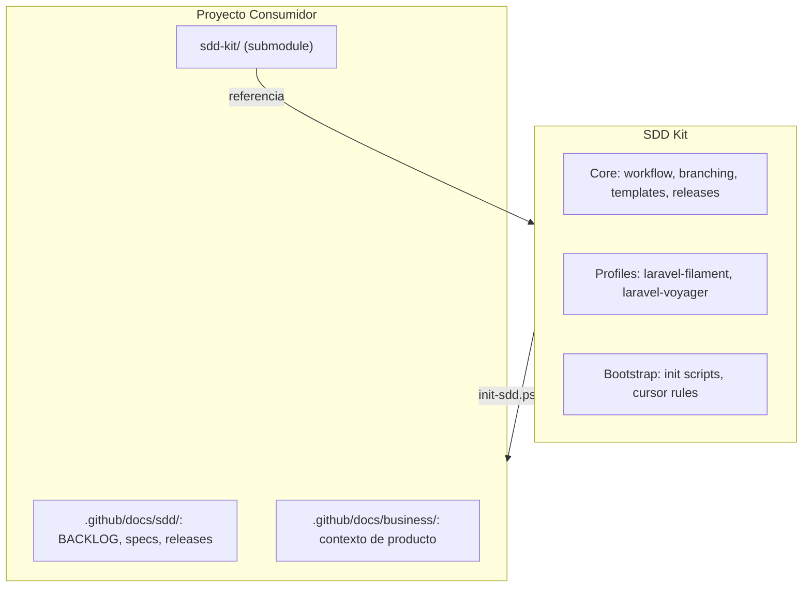
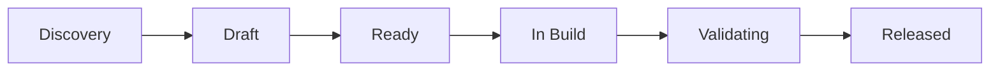
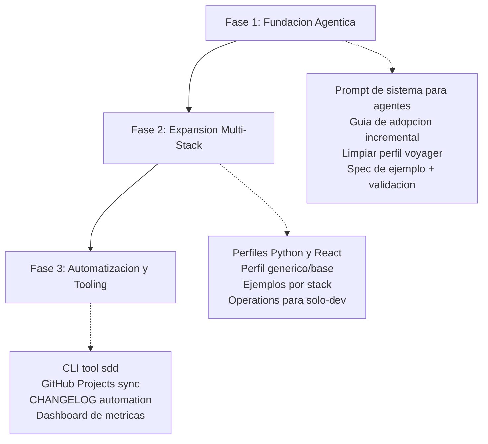

# Analisis Critico del SDD Kit

> Evaluacion integral del kit para desarrollo agentico multi-stack.
> Fecha: 2026-06-11

---

## Resumen Ejecutivo

El SDD Kit tiene una **base solida** en su arquitectura core/perfil y su ciclo de vida de specs. Sin embargo, presenta **tres problemas estructurales** que limitan su utilidad para el escenario objetivo: (1) esta acoplado de facto a Laravel, sin soporte real para otros stacks; (2) no esta optimizado para desarrollo 100% agentico, donde el agente de IA escribe todo el codigo; y (3) el perfil `laravel-voyager` esta contaminado con logica de negocio de un proyecto especifico.

La oportunidad mas inmediata y de mayor impacto es transformar las reglas Cursor de referencias pasivas a un **prompt de sistema detallado** que permita a un agente ejecutar el ciclo SDD de forma autonoma: desde una idea vaga hasta un spec validado, codigo implementado y release documentado.

## Contexto y Objetivo de la Evaluacion

### Escenario objetivo

| Variable                      | Valor                                                                                     |
| ----------------------------- | ----------------------------------------------------------------------------------------- |
| **Usuarios**                  | Desarrolladores con nivel tecnico en su stack, pero sin metodologia de desarrollo         |
| **Equipo tipico**             | 1 persona (desarrollador unico)                                                           |
| **Modo de trabajo**           | 100% agentico — el agente de IA escribe el codigo, el humano revisa y aprueba             |
| **Stacks**                    | Laravel (actual), Python, React (futuro inmediato)                                        |
| **Proyectos**                 | Nuevos y existentes. Los existentes tienen documentacion mixta (algunos cero, otros algo) |
| **Problema que resuelve SDD** | Proyectos sin hoja de ruta, erraticos, de dificil mantencion                              |

### Principio rector

> Spec antes de codigo, evidencia antes de despliegue, archivo despues de release.

---

## Arquitectura Actual



### Estructura de archivos

```
sdd-kit/
├── README.md
├── INSTALL.md
├── sdd.config.example.yaml
├── docs/maintainers/                 # este documento y roadmap
├── core/
│   ├── workflow.md                   # ciclo de 6 estados, tipos de spec, ADR, DoR/DoD
│   ├── operations.md                 # matriz de responsabilidades, rituales
│   ├── branching.md                  # politica de ramas dev/main, hotfix, releases
│   ├── checklist-pr.md               # DoD de trazabilidad (comun a todos los stacks)
│   ├── healthy-development.md        # arquitectura, patrones, codigo limpio
│   ├── adr/README.md
│   ├── releases/RUNBOOK.md           # 7 fases de release
│   ├── releases/README.md
│   └── templates/
│       ├── spec-template.md
│       ├── BACKLOG-template.md
│       ├── pr-template.md
│       ├── release-template.md
│       └── adr-template.md
├── profiles/
│   ├── laravel-filament/
│   │   ├── README.md
│   │   ├── branching-extensions.md
│   │   ├── checklist-stack.md
│   │   ├── deploy.md
│   │   ├── spec-impact.md
│   │   ├── release-deploy-section.md
│   │   └── sdd.config.yaml
│   └── laravel-voyager/
│       ├── README.md
│       ├── branching-extensions.md
│       ├── checklist-stack.md
│       ├── deploy.md
│       ├── spec-impact.md
│       ├── release-deploy-section.md
│       └── sdd.config.yaml
└── bootstrap/
    ├── init-sdd.sh
    ├── init-sdd.ps1
    └── cursor-rules/
        ├── sdd-core.mdc
        ├── sdd-stack-laravel-filament.mdc
        └── sdd-stack-laravel-voyager.mdc
```

### Ciclo de vida de una iniciativa



| Etapa      | Artefacto                                        | Criterio de salida                              |
| ---------- | ------------------------------------------------ | ----------------------------------------------- |
| Discovery  | Notas en BACKLOG                                 | Problema entendido, dominio y tipo declarados   |
| Draft      | `specs/<dominio>/SDD-NNN-slug.md`                | DoR cumplida                                    |
| Ready      | Spec con `Estado: Ready`                         | Owner, version objetivo, dependencias resueltas |
| In Build   | Rama + PR hacia rama de desarrollo               | Quality gates del perfil en verde               |
| Validating | PR + checklist-pr.md + perfil stack              | DoD cumplida                                    |
| Released   | `archive/<YYYY>/<dominio>/` + entrada en release | Mergeado, desplegado, archivado                 |

---

## Fortalezas

### 1. Arquitectura de 3 capas bien diseada

La separacion `core/` (agnostico) + `profiles/<stack>/` (especifico) + instancia de proyecto es elegante y escalable. Permite que el core evolucione sin romper perfiles, y que cada proyecto personalice sin perder actualizaciones del kit. Esta arquitectura es el activo mas valioso del kit y debe preservarse.

### 2. Ciclo de vida de spec claro y trazable

Los 6 estados con criterios de salida explicitos dan estructura a equipos que carecen de metodologia. La taxonomia de 6 tipos de spec (`feature`, `bugfix`, `performance`, `refactor`, `db-change`, `documentation`) cubre bien los casos comunes. Las reglas de transicion son inequivocas: cada cambio de estado en cabecera del spec y en BACKLOG.

### 3. DoR y DoD documentados explicitamente

Las definiciones de _Definition of Ready_ y _Definition of Done_ estan escritas, no asumidas. Se complementan con checklists de PR separados por stack (`checklist-pr.md` + `checklist-stack.md`). Esto es exactamente lo que un equipo o agente sin proceso necesita como referencia unica de calidad.

### 4. Runbook de release solido y detallado

Las 7 fases del `RUNBOOK.md` son exhaustivas, reproducibles y cubren el caso patologico de "archivar specs despues del merge en produccion" (prohibiendolo explicitamente en `branching.md`). La verificacion de paridad post-sync (`git rev-parse origin/main` == `git rev-parse origin/dev`) es un detalle que demuestra madurez operativa.

### 5. Reglas Cursor existentes como base

Los archivos `.mdc` en `bootstrap/cursor-rules/` muestran que el kit ya contempla agentes de IA como lectores. Las reglas son concisas y accionables. Tienen `alwaysApply: true`, lo que garantiza que el agente las vea en cada sesion.

### 6. Bootstrap automatizado

Los scripts `init-sdd.sh` y `init-sdd.ps1` generan toda la estructura de directorios, copian plantillas, reemplazan variables del proyecto (`{{PROJECT_NAME}}`, perfil) y opcionalmente instalan reglas Cursor. Reduce la friccion de adopcion a un solo comando. La estructura resultante es inmediatamente funcional.

### 7. Separacion clara entre documentacion de proceso y negocio

La distincion entre `paths.sdd` (metodologia) y `paths.business` (contexto de producto) es correcta y previene la mezcla de capas que tipicamente genera entropia documental.

### 8. Versionado SemVer y release por carpeta

Cada release tiene su carpeta `releases/vX.Y.Z/` con notas, checklist y referencia al PR de campana. Esto crea un historial navegable y auditable sin depender de herramientas externas.

---

## Debilidades

### 1. Solo dos perfiles, ambos Laravel

No existe perfil para Node.js, Python, Go, React, Vue, ni siquiera un perfil generico/base. El kit se presenta como "agnostico al stack" pero en la practica solo funciona con Laravel. Esto es una **barrera de entrada** para cualquier proyecto no-Laravel y contradice la promesa del README.

**Impacto:** Un proyecto Python o React no puede usar el kit hoy sin crear su propio perfil desde cero, sin guia ni referencia.

### 2. El perfil `laravel-voyager` esta contaminado con dominio de negocio

Items como `cen_hie_dependency_id`, `indicatorType`, `COMGES`, bifurcacion `ano < 2025` / `ano >= 2025`, `CurrentCutoffPolicy`, roles `admin/parametrizador/user/visualizador` y gates `current-add-edit`/`current-download` son **logica de negocio de un proyecto especifico** (aparentemente del Ministerio de Salud chileno).

Esto viola la separacion core/perfil/instancia que el propio kit define: ese conocimiento deberia vivir en `business/` del proyecto consumidor, no en el perfil del kit.

**Archivos afectados:**

- `profiles/laravel-voyager/checklist-stack.md` — seccion "Dominio de aplicacion" (lineas 20-26)
- `profiles/laravel-voyager/spec-impact.md` — tabla completa de impacto (lineas 15-28)
- `profiles/laravel-voyager/deploy.md` — comandos `centinela:deploy:*` (lineas 32-33)
- `bootstrap/cursor-rules/sdd-stack-laravel-voyager.mdc` — seccion "Dominio de aplicacion" (lineas 21-25)

**Impacto:** El perfil no es reutilizable por otros proyectos Laravel+Voyager. Cada nuevo proyecto heredaria reglas de negocio ajenas.

### 3. Reglas Cursor sub-dimensionadas para desarrollo agentico

Las reglas `.mdc` actuales son directivas pasivas ("lee workflow.md", "spec antes de codigo", "no crees docs fuera de paths.sdd"). Para un agente que debe ejecutar el proceso autonomamente, esto es insuficiente.

**Lo que falta:**

- **Prompt detallado por fase**: que hace el agente en Discovery vs Draft vs In Build
- **Criterios de calidad de spec**: condiciones machine-checkable que el agente pueda auto-verificar (campos obligatorios, formato de IDs, reglas de transicion)
- **Manejo de errores**: que hacer si el spec se estanca, si el humano pide cambios, si hay conflicto entre specs
- **Ejemplos concretos**: specs bien escritos que el agente pueda emular

**Impacto:** Un agente sin experiencia previa en SDD producira specs de baja calidad, inconsistentes o incompletos. El humano tendra que micro-gestionar el proceso.

### 4. Templates vacios, sin ejemplos ni criterios de calidad

Todas las plantillas (`spec-template.md`, `adr-template.md`, `release-template.md`, `BACKLOG-template.md`) son esqueletos con placeholders. Para un humano sin metodologia (o un agente), esto es insuficiente.

**Lo que falta en cada template:**

- Un spec de ejemplo completo (`SDD-001`) como referencia
- Notas sobre el nivel de detalle esperado en cada seccion
- Anti-patrones: que NO poner en cada seccion
- Longitud esperada (ej. "Resumen: 2-4 lineas. Problema: 1 parrafo. Diseno tecnico: tabla de archivos")

**Impacto:** La calidad de los specs depende enteramente de la intuicion del autor (humano o agente). No hay consistencia entre specs de distintos proyectos.

### 5. `BACKLOG.md` no escala ni se valida

Un archivo markdown plano como unico tablero de iniciativas es fragil a medida que crece el proyecto:

- **Sin validacion de IDs duplicados**: el agente podria reusar un `SDD-NNN`
- **Sin verificacion de consistencia de estados**: un spec en `specs/` podria no tener entrada en BACKLOG o viceversa
- **Sin filtrado**: buscar specs por dominio, estado o version requiere grep manual
- **Sin sincronizacion con GitHub Issues/Projects**: doble entrada manual

**Impacto:** A partir de ~20 specs, mantener el BACKLOG manualmente se vuelve propenso a errores. Un agente puede facilmente introducir inconsistencias.

### 6. Cero tooling de soporte

No hay scripts para tareas rutinarias de mantenimiento del proceso SDD:

| Necesidad                                        | Estado actual |
| ------------------------------------------------ | ------------- |
| Validar BACKLOG (IDs unicos, estados coherentes) | No existe     |
| Generar CHANGELOG desde releases                 | No existe     |
| Verificar que un spec cumple DoR                 | No existe     |
| Chequear enlaces rotos entre specs/ADR/releases  | No existe     |
| Generar indice de specs por estado/dominio       | No existe     |

**Impacto:** La carga operativa de mantener SDD recae enteramente en el humano, que ya tiene poca metodologia. El agente podria generar documentacion inconsistente sin que nadie lo detecte.

### 7. Sin guia de adopcion para proyectos existentes

El `INSTALL.md` y los scripts de bootstrap asumen proyecto nuevo (`init-sdd.ps1` crea BACKLOG vacio, estructura desde cero). No hay:

- **Estrategia de adopcion incremental**: empezar solo con BACKLOG, luego specs para features nuevos
- **Como mapear codigo existente**: crear specs retrospectivos para features ya implementadas
- **Que hacer con deuda tecnica pre-existente**: registrarla en BACKLOG como `Discovery`, crear specs de refactor, o documentar en ADR
- **Migracion de documentacion existente**: como mover READMEs/wiki a `business/`

**Impacto:** Un proyecto existente que quiera adoptar SDD no tiene una ruta clara. La alternativa "borrar todo y empezar de cero" no es viable en produccion.

### 8. Sin metricas de salud del proceso

No hay forma de medir si SDD esta funcionando. Un desarrollador solo (o su lider) no puede responder preguntas como:

- ¿Cual es la velocidad del ciclo (dias promedio Discovery → Released)?
- ¿Cuantos specs estan estancados (>2 semanas sin cambio de estado)?
- ¿Que proporcion del codigo esta cubierta por specs?
- ¿Cuantos cambios triviales (ID `—`) hay vs cambios con spec?

**Impacto:** Sin metricas, no hay mejora continua del proceso. SDD se vuelve un checklist burocratico en lugar de una herramienta de gestion.

### 9. Dependencia de submodule de Git sin validacion

Aunque `INSTALL.md` menciona alternativas (copia puntual, subtree), el submodule es fragil para equipos sin experiencia en Git avanzado. Los scripts de bootstrap no validan si el submodule esta correctamente inicializado antes de copiar archivos.

**Impacto:** `init-sdd.ps1` fallara con errores confusos si el submodule no se clono correctamente. No hay un mensaje de error amigable que diga "ejecuta `git submodule update --init` primero".

### 10. `operations.md` sobrediseñada para desarrollador solo

La matriz de responsabilidades asume roles que no existen en equipos de 1 persona: "Tech lead / PO", "Release owner", "Operaciones", "Lider backlog", "Owner". Para un solo dev, todas estas responsabilidades colapsan en una persona.

**Impacto:** El documento genera confusion en lugar de claridad. El agente podria asumir que necesita consultar a multiples roles antes de actuar.

---

## Oportunidades

### Corto plazo — Quick Wins (Fase 1)

| #   | Oportunidad                                                                                           | Impacto | Esfuerzo |
| --- | ----------------------------------------------------------------------------------------------------- | ------- | -------- |
| 1   | **Prompt de sistema para agentes** — regla Cursor con instrucciones detalladas por fase del ciclo SDD | Alto    | Medio    |
| 2   | **Guia de adopcion incremental** — 3 etapas para proyectos nuevos y existentes                        | Alto    | Medio    |
| 3   | **Limpiar perfil voyager** — extraer dominio de negocio a `business/domain-template.md`               | Alto    | Bajo     |
| 4   | **Spec de ejemplo SDD-001** — un spec completo y bien escrito como referencia                         | Medio   | Bajo     |
| 5   | **Script de validacion** — `validate-sdd.sh` que revise coherencia de BACKLOG                         | Medio   | Bajo     |

### Mediano plazo — Crecimiento (Fase 2)

| #   | Oportunidad                                                                           | Impacto | Esfuerzo |
| --- | ------------------------------------------------------------------------------------- | ------- | -------- |
| 6   | **Perfil `python-fastapi`** — quality gates (pytest, ruff, mypy), deploy, spec-impact | Alto    | Medio    |
| 7   | **Perfil `react-vite`** — quality gates (vitest, eslint, tsc), deploy, spec-impact    | Alto    | Medio    |
| 8   | **Perfil generico/base** — template documentado para crear perfiles de nuevos stacks  | Medio   | Medio    |
| 9   | **Ejemplos de specs por perfil** — SDD-001 en cada stack                              | Medio   | Bajo     |
| 10  | **`operations.md` para solo-dev** — simplificar rituales para equipos de 1 persona    | Medio   | Bajo     |

### Largo plazo — Vision (Fase 3)

| #   | Oportunidad                                                                       | Impacto | Esfuerzo |
| --- | --------------------------------------------------------------------------------- | ------- | -------- |
| 11  | **CLI tool `sdd`** — validar, generar specs desde prompts, sincronizar con GitHub | Alto    | Alto     |
| 12  | **Integracion con GitHub Projects** — BACKLOG sincronizado bidireccionalmente     | Medio   | Alto     |
| 13  | **Generacion automatica de CHANGELOG.md** — desde `releases/vX.Y.Z/`              | Medio   | Medio    |
| 14  | **Dashboard de metricas SDD** — velocidad, estancamiento, cobertura               | Bajo    | Alto     |
| 15  | **Perfiles adicionales** — Go, Node/Express, Vue, Django                          | Medio   | Medio    |

---

## Conclusiones

1. El SDD Kit es un **excelente punto de partida** con una arquitectura bien pensada (core/perfil/instancia) y un ciclo de vida de specs robusto. No necesita ser reescrito desde cero.

2. La **brecha mas urgente** es la capacidad agentica: las reglas Cursor deben evolucionar de referencias pasivas a un prompt de sistema que guie al agente por cada fase del ciclo, con criterios de calidad auto-verificables.

3. La **contaminacion de dominio** en el perfil voyager debe resolverse antes de que el kit escale a mas proyectos. Un perfil que mezcla stack y negocio no es reutilizable.

4. La **expansion multi-stack** (Python, React) es necesaria para cumplir la promesa de "agnostico al stack" del README, pero debe hacerse sobre una base agentica solida, no antes.

5. El kit actual **funciona bien para su caso de uso original** (Laravel, equipo pequeño con cierta disciplina). La evolucion propuesta no descarta nada de lo existente; agrega capas sobre la misma arquitectura.

### Recomendacion de prioridad



La Fase 1 es prerequisito de la Fase 2, y la Fase 2 es prerequisito de la Fase 3. No tiene sentido crear perfiles para nuevos stacks si el agente no sabe usarlos, ni automatizar con CLI si los perfiles no estan estandarizados.

---

## Referencias

- [README.md](../../README.md) — descripcion general del kit
- [ROADMAP.md](ROADMAP.md) — plan de evolucion por fases
- [core/workflow.md](../../core/workflow.md) — ciclo SDD, tipos de spec, DoR/DoD
- [core/operations.md](../../core/operations.md) — matriz de responsabilidades y rituales
- [core/branching.md](../../core/branching.md) — politica de ramas
- [core/checklist-pr.md](../../core/checklist-pr.md) — DoD de trazabilidad
- [core/releases/RUNBOOK.md](../../core/releases/RUNBOOK.md) — 7 fases de release
