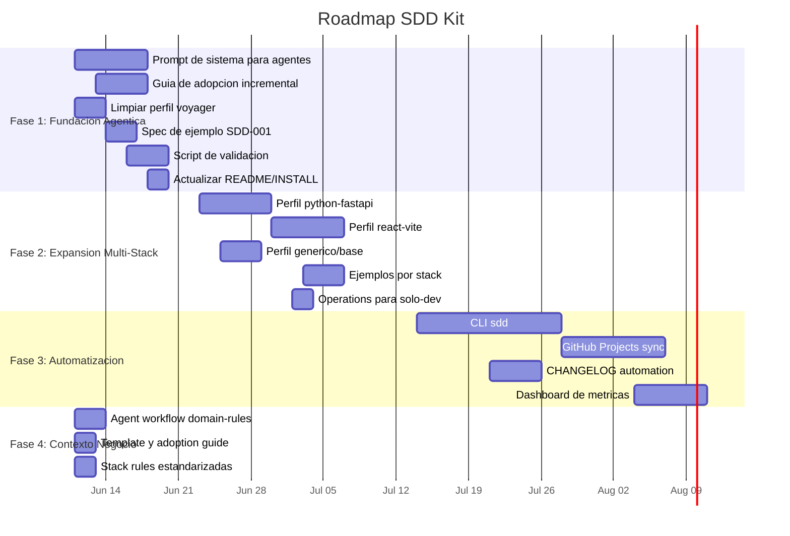

# Roadmap de Evolucion del SDD Kit

> Plan de evolucion en 3 fases para transformar el kit en una herramienta de desarrollo 100% agentico, multi-stack y con adopcion incremental.
> Fecha: 2026-06-11

---

## Vision

Un kit de desarrollo guiado por especificaciones que un **agente de IA pueda ejecutar de forma autonoma**, desde una idea vaga hasta codigo implementado y release documentado, en cualquier stack tecnologico y en proyectos nuevos o existentes.

---

## Principios de diseno para la evolucion

1. **El agente es el principal lector y ejecutor.** Todo artefacto (plantilla, regla, script) debe estar disenado para ser interpretado y ejecutado por un agente, no solo leido por un humano.
2. **El humano revisa y aprueba, no ejecuta.** El flujo asume que el agente produce artefactos (specs, codigo, PRs, releases) y el humano los valida.
3. **Adopcion incremental, no big-bang.** Un proyecto existente debe poder adoptar SDD etapa por etapa, sin reescribir su documentacion ni detener su desarrollo.
4. **Core agnostico, perfiles concretos.** El core no menciona ningun stack. Cada perfil es autocontenido y define todo lo especifico de su tecnologia.
5. **Validacion automatica siempre que sea posible.** Toda regla que pueda verificarse mecanicamente debe tener un script o criterio programatico asociado.

---

## Fase 1: Fundacion Agentica

**Estado:** Implementada (2026-06-11)

**Objetivo:** Que un agente de IA pueda seguir el ciclo SDD completo de forma autonoma, y que un proyecto existente pueda adoptar SDD sin friccion.

**Depende de:** Nada. Se construye sobre lo existente.

### Entregables

#### 1.1 Prompt de sistema para agentes: `sdd-agent-workflow.mdc`

Regla Cursor con `alwaysApply: true` que contiene:

- **Instrucciones por fase del ciclo** (Discovery, Draft, Ready, In Build, Validating, Released)
- **Criterios de calidad auto-verificables** (campos de cabecera obligatorios, formato de ID, dominio valido segun config, reglas de transicion de estados)
- **Manejo de errores y excepciones** (que hacer si el spec se estanca, si el humano rechaza, si hay conflicto entre specs)
- **Checklist de auto-verificacion de DoR y DoD** que el agente ejecuta antes de pedir revision humana
- **Adaptado a solo-dev**: sin referencias a "tech lead", "PO", "revision semanal con owners"

#### 1.2 Guia de adopcion incremental: `core/adoption-guide.md`

Documento con 3 etapas de adopcion:

**Etapa 1 — Minima viable (dia 1)**

- `init-sdd.ps1` genera estructura
- Crear `BACKLOG.md` con inventario de lo que YA hace el sistema (no specs retrospectivos)
- Identificar 3-5 iniciativas prioritarias como `Discovery`
- Checklist: estructura creada, BACKLOG con al menos 3 items, `business/README.md` completado

**Etapa 2 — Nuevas features con SDD (semana 1+)**

- Solo features NUEVAS usan el ciclo SDD completo
- Bugs y cambios triviales usan ID `—` en release
- Releases documentan cambios aunque no todos tengan spec
- Checklist: al menos 1 spec completado en el ciclo completo, releases con entradas de spec

**Etapa 3 — Cobertura completa (mes 2+)**

- Refactors y mejoras usan spec
- ADRs para decisiones arquitectonicas pendientes
- Migracion de documentacion existente a `business/`
- Checklist: specs para todos los cambios no triviales, ADRs para decisiones mayores, docs legacy migrados

#### 1.3 Limpieza del perfil `laravel-voyager`

Extraer el dominio de negocio a un template `business/domain-template.md` que el `init-sdd.ps1` copia opcionalmente.

**Archivos a modificar:**

- `profiles/laravel-voyager/checklist-stack.md` — eliminar seccion "Dominio de aplicacion"
- `profiles/laravel-voyager/spec-impact.md` — eliminar preguntas de negocio, dejar solo tecnicas
- `profiles/laravel-voyager/deploy.md` — eliminar comandos `centinela:*`
- `bootstrap/cursor-rules/sdd-stack-laravel-voyager.mdc` — eliminar seccion "Dominio de aplicacion"

**Archivos nuevos:**

- `core/templates/business-domain-template.md` — plantilla de dominio de negocio reutilizable

#### 1.4 Spec de ejemplo: `SDD-001` en perfil `laravel-filament`

Un spec completo y bien escrito (`specs/ux/SDD-001-login-con-recuperacion.md`) que cubre:

- Cabecera completa con todos los campos
- Problema/objetivo concreto
- Alcance con inclusiones y exclusiones
- Impacto tecnico con respuestas reales (no "No aplica")
- Criterios de aceptacion happy path + error path
- Diseno tecnico con tabla de archivos
- Riesgos y rollback

Este spec sirve como **referencia de calidad** para que el agente emule el nivel de detalle esperado.

#### 1.5 Script de validacion: `bootstrap/validate-sdd.sh`

```bash
./sdd-kit/bootstrap/validate-sdd.sh
```

Verifica:

- BACKLOG: IDs unicos, estados coherentes (no puede haber un spec en `In Build` si no paso por `Ready`)
- Specs en `specs/`: cada uno tiene entrada en BACKLOG con estado coincidente
- Specs en `archive/`: cada uno tiene entrada en `Released` del BACKLOG
- Releases: cada spec en `Released` referencia una version de release existente
- IDs duplicados: no hay dos specs con el mismo `SDD-NNN`

Salida: reporte de errores con sugerencias de correccion.

### Resultado esperado

Al finalizar la Fase 1, un agente de IA puede:

1. Recibir una idea vaga del humano ("necesito que los usuarios puedan exportar datos a Excel")
2. Crear un spec Draft en el dominio y tipo correctos
3. Auto-verificar que el spec cumple DoR
4. Presentar el spec al humano para revision
5. Implementar el codigo siguiendo el spec
6. Auto-verificar DoD
7. Crear PR con checklist
8. Cerrar release: archivar spec, actualizar BACKLOG

Y un proyecto existente puede adoptar SDD incrementalmente sin detener su desarrollo.

---

## Fase 2: Expansion Multi-Stack

**Estado:** Implementada (2026-06-11)

**Objetivo:** Soportar Python/FastAPI y React/Vite como stacks de primera clase, con el mismo nivel de detalle que los perfiles Laravel actuales.

**Depende de:** Fase 1 completada. Los perfiles nuevos usan las reglas agenticas y la guia de adopcion de la Fase 1.

### Entregables

#### 2.1 Perfil `python-fastapi`

Estructura:

```
profiles/python-fastapi/
├── README.md                    # indice y quality gates
├── sdd.config.yaml              # valores por defecto
├── checklist-stack.md           # DoD tecnico: pytest, ruff, mypy, endpoints, migraciones
├── spec-impact.md               # tabla de impacto tecnico para APIs REST
├── deploy.md                    # despliegue tipico (Docker, script, plataforma cloud)
├── release-deploy-section.md    # bloque reusable para notas de release
└── branching-extensions.md      # si aplica (Dependabot/Pipfile, etc.)
```

**Quality gates:**

- `pytest --cov` (tests + cobertura)
- `ruff check .` (lint)
- `mypy .` (type checking)
- CI: `.github/workflows/ci.yml` en verde

**Reglas Cursor:** `bootstrap/cursor-rules/sdd-stack-python-fastapi.mdc`

#### 2.2 Perfil `react-vite`

Estructura:

```
profiles/react-vite/
├── README.md                    # indice y quality gates
├── sdd.config.yaml              # valores por defecto
├── checklist-stack.md           # DoD tecnico: vitest, eslint, prettier, tsc, a11y
├── spec-impact.md               # tabla de impacto: rutas, componentes, estado global, accesibilidad
├── deploy.md                    # despliegue tipico (Vercel, Netlify, build estatico)
├── release-deploy-section.md    # bloque reusable para notas de release
└── branching-extensions.md      # si aplica
```

**Quality gates:**

- `vitest run` (tests)
- `eslint .` (lint)
- `prettier --check .` (formato)
- `tsc --noEmit` (type checking)
- CI: `.github/workflows/ci.yml` en verde

**Reglas Cursor:** `bootstrap/cursor-rules/sdd-stack-react-vite.mdc`

#### 2.3 Perfil generico/base: `core/templates/profile-template.md`

Guia para crear perfiles de nuevos stacks. Define:

- Archivos obligatorios de un perfil
- Secciones obligatorias en cada archivo
- Valores necesarios en `sdd.config.yaml`
- Ejemplo minimo funcional

#### 2.4 Specs de ejemplo por perfil

- `profiles/python-fastapi/SDD-001-ejemplo-api-crud.md`: spec de ejemplo para API REST con FastAPI
- `profiles/react-vite/SDD-001-ejemplo-componente-formulario.md`: spec de ejemplo para componente React con formulario

#### 2.5 `operations.md` para solo-dev

Version simplificada de `operations.md` sin matriz de roles. Un solo dev:

- Decide que construir (Discovery)
- El agente crea el spec (Draft)
- El dev revisa y aprueba (Ready)
- El agente implementa (In Build → Validating)
- El agente cierra release (Released)

### Resultado esperado

Al finalizar la Fase 2:

- 4 perfiles funcionales: `laravel-filament`, `laravel-voyager` (limpio), `python-fastapi`, `react-vite`
- Cualquier desarrollador puede crear un perfil para su stack siguiendo la plantilla generica
- Los agentes pueden trabajar en Python y React con la misma fluidez que en Laravel

---

## Fase 3: Automatizacion y Tooling

**Estado:** Implementada (2026-06-11) — dashboard Canvas opcional pendiente

**Objetivo:** Reducir la carga operativa de mantener SDD con herramientas automaticas y una CLI.

**Depende de:** Fase 2 completada. La CLI asume perfiles estandarizados.

### Entregables

#### 3.1 CLI `sdd`

Comando unificado para operaciones SDD:

```bash
sdd init --profile python-fastapi --project "Mi API"
sdd validate                 # ejecuta validate-sdd.sh
sdd backlog                  # muestra BACKLOG con filtros
sdd spec new --domain ux --type feature --title "Login con 2FA"
sdd spec status SDD-005      # muestra estado actual y transiciones posibles
sdd release changelog        # genera CHANGELOG.md desde releases/
sdd release close v1.2.0     # verifica cierre, genera nota, actualiza BACKLOG
```

#### 3.2 Integracion con GitHub Projects

BACKLOG sincronizado bidireccionalmente:

- Cada item del BACKLOG tiene un Issue de GitHub asociado
- Cambios de estado en GitHub Issues se reflejan en BACKLOG.md
- La CLI `sdd backlog sync` reconcilia diferencias

#### 3.3 Generacion automatica de CHANGELOG

`CHANGELOG.md` generado desde `releases/vX.Y.Z/` con formato Keep a Changelog.
Se ejecuta como parte de `sdd release close` o manualmente con `sdd release changelog`.

#### 3.4 Dashboard de metricas (opcional, canvas)

Visualizacion de salud del proceso SDD via Cursor Canvas:

- Velocidad del ciclo (dias promedio Discovery → Released)
- Specs estancados (>2 semanas)
- Distribucion por tipo (feature vs bugfix vs refactor)
- Tasa de cambios con spec vs sin spec (ID `—`)

#### 3.5 Perfiles adicionales (a demanda)

- `node-express` — Node.js + Express + Jest + ESLint
- `go-api` — Go + net/http o chi + testing + golangci-lint
- `vue-vite` — Vue 3 + Vite + Vitest + ESLint + Prettier
- `django` — Django + pytest + ruff + mypy + migraciones

### Resultado esperado

Al finalizar la Fase 3:

- Mantener SDD en un proyecto requiere esfuerzo minimo (la CLI automatiza lo repetitivo)
- Las metricas permiten mejorar el proceso continuamente
- Nuevos stacks se agregan bajo demanda sin modificar el core

---

## Fase 4: Formalizacion del Contexto de Negocio

**Estado:** Implementada (2026-06-11)

**Objetivo:** Que el agente detecte `domain-rules.md` en estado plantilla, guie al humano en una sesion de preguntas para extraer el contexto, y use esas reglas como fuente unica de verdad al crear specs y verificar PRs.

**Distribucion del kit:** Se mantiene **submodulo** como mecanismo recomendado (ver [INSTALL.md](../../INSTALL.md)). La CLI y `init-sdd` dependen de tener el kit en `sdd-kit/` dentro del repo consumidor.

**Depende de:** Fases 1–3 completadas (reglas agenticas, perfiles multi-stack, CLI).

### Problema que resuelve

Al adoptar SDD, `business/domain-rules.md` queda con placeholders. El agente no distingue "no hay reglas" de "no las documente todavia" y puede proceder sin restricciones de negocio que el humano conoce pero no escribio.

### Entregables

#### 4.1 Discovery extendida en `sdd-agent-workflow.mdc`

- Deteccion de estado plantilla (`_ej._`, `_..._`, `{{PROJECT_NAME}}`)
- Sesion guiada con 7 preguntas para formalizar dominio
- Reglas en DoR/DoD: citar `domain-rules.md` en specs y PRs
- Anti-patron: no asumir reglas no escritas

#### 4.2 Plantilla enriquecida `business-domain-template.md`

- Seccion "Sesion guiada" con preguntas para el agente
- Ejemplo completado (sistema de inventario)
- Instrucciones: borrar secciones que no apliquen

#### 4.3 Reglas estandar en los 4 perfiles stack (`sdd-stack-*.mdc`)

- `domain-rules.md` como fuente unica
- Deteccion de plantilla y derivacion a sesion guiada
- Obligacion de citar reglas en "Impacto tecnico" del spec

#### 4.4 Referencia en `sdd-core.mdc`

- Lectura obligatoria de `business/domain-rules.md`
- Regla: no asumir reglas no documentadas

#### 4.5 Guia en `adoption-guide.md`

- Seccion "Formalizar el contexto de negocio"
- Cuando completar, sesion guiada, valor para desarrollo agentico

### Resultado esperado

Al finalizar la Fase 4:

- El agente pregunta antes de asumir reglas de negocio
- Proyectos nuevos pueden formalizar dominio en una sesion guiada (dia 1)
- Specs y PRs referencian reglas trazables en `domain-rules.md`

### Metricas de exito

- [x] `sdd-agent-workflow.mdc` detecta plantilla y define sesion guiada
- [x] `business-domain-template.md` incluye ejemplo y preguntas guia
- [x] Los 4 perfiles stack tienen seccion estandar de reglas de negocio
- [x] `sdd-core.mdc` referencia `business/domain-rules.md`
- [x] `adoption-guide.md` documenta formalizacion del contexto
- [ ] Validacion en produccion: agente formaliza domain-rules en proyecto real (pendiente uso)

---

## Linea de Tiempo Estimada



### Hitos

| Fecha      | Hito           | Entregables                                                                                                        |
| ---------- | -------------- | ------------------------------------------------------------------------------------------------------------------ |
| 2026-06-20 | **Fin Fase 1** | Prompt agentico, guia de adopcion, perfil voyager limpio, spec de ejemplo, script de validacion, docs actualizados |
| 2026-07-10 | **Fin Fase 2** | Perfiles Python y React, plantilla generica, specs de ejemplo, operations simplificado                             |
| 2026-08-15 | **Fin Fase 3** | CLI `sdd`, sync GitHub Projects, CHANGELOG automatico, dashboard de metricas                                       |
| 2026-06-11 | **Fin Fase 4** | Formalizacion contexto negocio: agent workflow, template, stack rules, adoption guide                              |

---

## Metricas de Exito por Fase

### Fase 1

- [x] Prompt agentico (`sdd-agent-workflow.mdc`) instalado con `-Cursor`
- [x] Guia de adopcion incremental (`core/adoption-guide.md`)
- [x] Script `validate-sdd` detecta ID duplicado, spec huerfano, estado inconsistente
- [x] Spec de ejemplo en `profiles/laravel-filament/examples/`
- [x] Perfil `laravel-voyager` sin referencias a COMGES, `cen_hie_dependency_id` ni `ano`
- [ ] Validacion en produccion: agente completa ciclo con proyecto real (pendiente uso)

### Fase 2

- [x] Perfil `python-fastapi` con README, checklist, spec-impact, deploy, ejemplo y regla Cursor
- [x] Perfil `react-vite` con README, checklist, spec-impact, deploy, ejemplo y regla Cursor
- [x] Plantilla generica `core/templates/profile-template.md`
- [x] `operations.md` con modo desarrollador solo
- [ ] Validacion en produccion con proyecto real Python/React (pendiente uso)

### Fase 3

- [x] CLI `sdd` via `bootstrap/sdd.ps1` y `sdd.sh` (Python 3.10+)
- [x] `sdd validate`, `backlog`, `spec new/status`, `release changelog/close`, `metrics`
- [x] `sdd backlog sync` con GitHub Issues (`gh` CLI)
- [x] CHANGELOG.md formato Keep a Changelog desde `releases/`
- [ ] Dashboard Canvas interactivo (opcional; `sdd metrics` cubre reporte texto)
- [ ] Perfiles adicionales node-express, django, etc. (a demanda)

---

## Riesgos y Mitigaciones

| Riesgo                                                                          | Probabilidad | Impacto | Mitigacion                                                                                                      |
| ------------------------------------------------------------------------------- | ------------ | ------- | --------------------------------------------------------------------------------------------------------------- |
| El prompt agentico no es suficiente y el agente produce specs de baja calidad   | Media        | Alto    | Iterar el prompt con feedback real de sesiones agenticas. Incluir ejemplos de specs de alta y baja calidad.     |
| Los perfiles Python/React no cubren casos reales por falta de uso en produccion | Alta         | Medio   | Crear los perfiles sobre proyectos reales, no especulativos. Validar con al menos un proyecto por stack.        |
| La CLI `sdd` requiere mas esfuerzo del estimado                                 | Media        | Medio   | Empezar con MVP: `validate` + `backlog`. Agregar comandos incrementalmente.                                     |
| GitHub Projects sync tiene dependencia de API que cambia                        | Baja         | Medio   | Usar `gh` CLI oficial. Abstraer la capa de sincronizacion para cambiar de backend si es necesario.              |
| Adopcion en proyectos existentes genera resistencia                             | Alta         | Bajo    | La guia de adopcion incremental minimiza friccion. Etapa 1 requiere solo 30 minutos y no detiene el desarrollo. |
| domain-rules.md queda en plantilla y el agente omite reglas de negocio          | Alta         | Alto    | Fase 4: deteccion de plantilla, sesion guiada y citas obligatorias en specs (implementado).                     |

---

## Referencias

- [core/healthy-development.md](../../core/healthy-development.md) — guia de desarrollo sano (arquitectura, patrones, codigo limpio)
- [ANALYSIS.md](ANALYSIS.md) — analisis critico detallado del estado actual
- [core/workflow.md](../../core/workflow.md) — ciclo SDD, tipos de spec, DoR/DoD
- [core/operations.md](../../core/operations.md) — matriz de responsabilidades y rituales
- [INSTALL.md](../../INSTALL.md) — instalacion actual del kit
